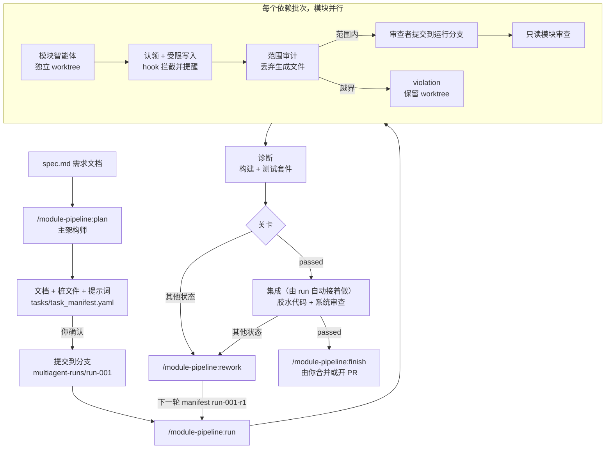

# Module Pipeline

[English](README.md) | **简体中文**

**module-pipeline** 是一个专门用于游戏开发的 Claude Code 插件：根据一份写好的需求文档（spec），由一组智能体
协作把游戏做出来。代码按“游戏怎样才好维护”来划分：一个数据层，若干各做一件事、互不引用的可复用系统，以及把
它们连起来的小胶水模块。每个智能体只能在自己的文件夹里写代码。智能体并行开发，每个通过的任务都是一个独立的
git 提交，每个阶段都有审查把关，失败的部分会进入有计划的返工轮次。

本仓库是一个 Claude Code 插件市场（marketplace），里面只有这一个插件，位于
[`plugins/module-pipeline`](plugins/module-pipeline/)。

> **当前状态：** 早期版本。有单元测试和 workflow 模拟测试覆盖，也已在真实的 Claude Code 会话里完整跑通过一次：
> 一个 10 个模块的浏览器幸存者小游戏，走完了规划、三批并行实现、集成、一轮返工和最终系统审查，共 56 个智能体。
> 那次运行暴露的问题已在 0.4.0 修复。可能还有不顺手的地方，遇到问题欢迎提 issue。

---

## 目录

- [为什么做这个](#为什么做这个)
- [它能做什么](#它能做什么)
- [一次运行的流程](#一次运行的流程)
- [环境要求](#环境要求)
- [安装](#安装)
- [快速上手](#快速上手)
- [命令说明](#命令说明)
- [任务清单 manifest](#任务清单-manifest)
- [结果与状态](#结果与状态)
- [返工循环](#返工循环)
- [收尾：合并运行分支](#收尾合并运行分支)
- [插件会写哪些文件](#插件会写哪些文件)
- [写入范围守卫保证什么](#写入范围守卫保证什么)
- [提高效果的建议](#提高效果的建议)
- [常见问题](#常见问题)
- [评测结果](#评测结果)
- [仓库结构与开发](#仓库结构与开发)

---

## 为什么做这个

让多个智能体同时改同一个代码库，通常会以几种可以预见的方式出错：两个智能体改了同一个文件；某个智能体
为了让自己跑通，顺手"修"了别人的代码；事后说不清哪个改动来自哪个智能体；审查来得太晚，或者干脆没有。

module-pipeline 把这些都变成由工具强制执行的规则，而不是只在提示词里"请求"智能体遵守：

| 问题 | 插件的做法 |
| --- | --- |
| 智能体互相覆盖代码 | 每个模块只拥有一个文件夹。两个模块拥有相同或嵌套的文件夹时，manifest 校验直接失败。 |
| 智能体越界修改 | `PreToolUse` hook 在智能体**工作过程中**拦截它对允许范围之外文件的编辑，并拒绝文本里能看出要写主工作区的 shell 命令。每条 shell 命令执行后，只要留下了越界文件，智能体会立刻收到提醒；合并前的审计会拒绝仍然存在的越界文件。这保证的是“什么能被合并”，不是沙箱（见[写入范围守卫保证什么](#写入范围守卫保证什么)）。 |
| 引擎自动生成的文件触发越界 | 引擎自己写出的文件（Godot 的 `.uid`、`.import` 文件、各种缓存）可以登记为生成文件；它们出现在模块范围之外时会被丢弃，而不是让整个模块失败。 |
| 改动难以追溯和撤销 | 每个通过的模块是专用运行分支 `multiagent-runs/<run-id>` 上的一个提交，你的主分支不会被动到。 |
| 智能体基于过期或看不到的状态工作 | 运行前必须先提交规划产物。每个智能体开始时都会被移到运行分支的最新提交，所以后面批次的模块能看到之前已合并的模块。 |
| 运行期间仓库被占住 | 智能体工作时，主工作区可以切回任何分支继续干活。合并和检查会改在一个单独的 worktree 里进行。 |
| 审查流于形式或被跳过 | 每个模块都有一个只读的对抗式审查者；集成后的整个系统还有一个系统审查者，逐条核对需求覆盖情况。 |
| 失败越积越多，没有处理计划 | 失败和阻塞性的审查问题会变成结构化的返工清单，由架构师逐条决定处理方式，并经你确认。 |

它是为游戏项目做的：浏览器游戏，以及 Godot、Unity 这类引擎。它规划出来的是一套游戏架构：玩法数据和代码
分开；玩家移动、生命值、刷怪这样的系统；敌人管理器这样的胶水模块；模拟和表现两个半边分开。它没有针对
其他类型的软件做过调整。

## 它能做什么

- **从需求文档出发做规划。** 你当前的 Claude Code 会话扮演**主架构师**（Main Architect）：读需求、按功能
  划分代码、按项目规模决定派几个智能体、设计共享层、写架构、接口契约和编码规范文档、生成桩文件、给每个任务
  写一份提示词，并产出一份通过校验的任务清单（manifest）。
- **按功能划分代码，不按规模。** 一份规划里有三类代码。**数据**（数值、文本、id）最先设计，集中放在数据层。
  **系统**各做一件事，各占一个文件夹，读数据，互相之间从不引用；两个分不开的系统就合并成一个。**胶水**负责
  把系统连起来，同样按功能拆成多个小的胶水模块，而不是用一个管理器粘住一切。逻辑和表现是两个半边，各有自己
  的系统、胶水和数据，表现只读逻辑的状态。**任务**是一个智能体的工作量：一个装着若干系统（或若干胶水模块）
  的文件夹。项目规模只决定任务有多少个。
- **先建共享层。** 多个系统都要用的数据层、工具函数和测试夹具，由一个任务在第一批次先建好，其他任务
  直接引用，不再各写一份。
- **事先定好跨模块规则。** 模块智能体只看得到接口契约，看不到别的模块的代码。几个模块必须用同一种做法的
  问题（时间怎么推进和比较、状态存在哪里由谁重置、单位和取整、一步之内的执行顺序、错误怎么处理），如果没人
  事先定下来，每个模块会各给一个答案。主架构师把这些一次写进 `docs/cross_module_rules.md`，共享层提供每条
  规则背后的代码，系统审查者再跨所有模块逐条核对。
- **并行完成各个任务。** 一个 Claude Code 动态工作流（dynamic workflow）为每个任务启动一个智能体，各自在独立的
  git worktree 里工作。任务分**批次**（wave）运行：先是共享层，然后所有装着系统的任务同时进行（它们互不依赖），
  最后是胶水任务，每个胶水任务等它要连接的任务都合并后才开始。
- **强制限定写入范围。** 每个智能体写任何东西之前，必须先为自己的任务**认领**（claim）所在的 worktree，
  认领时 worktree 会被移到运行分支的最新提交。之后 hook 只允许它编辑自己的文件夹、测试文件夹和报告文件，
  拒绝会改动主工作区的 shell 命令；任何 shell 命令留下了越界文件，它都会立刻收到提醒。
- **审计并提交。** 智能体完成后，由它的审查者执行合并：改动按写入范围逐一核对。范围内的改动被应用并提交到运行分支（你项目
  的 git hooks 照常运行）；范围外的生成文件被丢弃；其他越界改动被拒绝，worktree 保留下来供你检查。
- **审查每个任务。** 只读审查者检查验收标准、接口契约、测试和明显的缺陷，还要检查有没有系统引用了别的系统、
  有没有把该放进数据层的数值写在代码里，返回结构化的返工项，每项都带严重
  程度，并标明是否阻塞集成。
- **运行诊断。** 如果配置了构建或类型检查命令，模块合并后会运行它，并统计错误和警告数量。如果配置了测试命令，
  还会跑一遍完整的测试套件，抓住各模块自己的测试发现不了的跨模块问题。
- **集成。** 最后一个阶段编写入口：最上面一层胶水，也是唯一按顺序调用各个系统的地方，遵守同样的范围规则；
  随后系统审查者对照需求文档逐条打分。
- **规划返工。** 架构师把每个失败项变成一个决定（交回同一模块返工、新建模块、修改契约、暂缓，或者问你），
  并写出下一轮的 manifest。小的局部修改会作为一个**补丁**下发：一个智能体改完全部问题、一个审查者核对，
  不必走完整的模块和集成流程。
- **断点续跑。** 已合并的模块会被记录下来，重新运行时只做剩下的部分。如果运行被中断（用量上限、会话关闭）时
  某个模块的实现者已经写完，重新运行不会再写一遍，而是直接交给审查者。
- **让你的会话保持精简。** 会话里的每次调用都要带上整段对话，所以记账的事交给命令行脚本：每个阶段开始前
  一次 `prepare` 做完所有检查，结束后一次 `record` 运行诊断、写结果和报告，并输出摘要。
- **不占用你的工作区。** 运行进行中，你可以把主工作区切到别的分支继续工作。
- **写代码用 Sonnet，把关用 Opus。** 模块实现者和集成者用 Sonnet；模块审查者、系统审查者和补丁智能体用
  Opus。每个职责始终用所属系列的最新版。思考强度由你按职责分别设置：实现者、模块审查者、集成者和系统审查者。
  预设（`economy`、`balanced`、`quality`）可以一次设好全部职责；默认预设下所有智能体都用 `high`，
  主架构师（`plan`、`rework`）始终用 `high`。
- **智能体轻装上阵。** 只有主架构师加载你的 CLAUDE.md 文件；其他智能体启动时不加载，改读架构师写进
  `docs/conventions.md` 的项目规范。也不再为转发流水线命令单独启动智能体。
- **事先说明成本。** 规划结束时会列出每个阶段要启动多少个智能体，按职责、模型和思考强度分开列，按项目规模检查
  任务数量是否合适，并报告胶水在整个规划里占多大比例。
- **收尾。** `finish` 汇总运行分支、起草 PR 描述，并在你同意后合并或开 PR；`clean` 清理残留的 worktree
  和已合并的运行分支。

## 一次运行的流程



角色：

| 角色 | 由谁担任 | 能否写文件 |
| --- | --- | --- |
| 主架构师 | 你自己的会话，在 `plan` 和 `rework` 时 | 能，写文档、桩文件、提示词和 manifest |
| `module-implementer` | 每个任务一个工作流智能体（胶水任务也是） | 只能写本任务允许的文件 |
| `module-reviewer` | 每个模块一个 | 不能；先运行流水线的合并命令，再只读审查 |
| `integrator` | 集成阶段的一个智能体 | 只能写 `integration.allowed_files` |
| `system-reviewer` | 每次集成一个 | 不能；先合并胶水代码并运行诊断，再只读审查 |
| `patcher` | 每个补丁轮次一个（小改动返工） | 只能写 `patch.allowed_files` |

实现者和集成者用最新的 Sonnet，另外三个职责用最新的 Opus。思考强度在 manifest 里按职责设置（见
[模型与思考强度](#模型与思考强度)）。

## 环境要求

- **支持动态工作流的 Claude Code。** 所有付费套餐都可用；Pro 套餐需要在 `/config` 里打开
  *Dynamic workflows*。
- `PATH` 里有 **Node.js**。插件没有任何 npm 依赖。
- 目标项目是一个 **git 仓库**，已设置 `user.name` 和 `user.email`，并且至少有一个提交。
- **允许智能体运行你的测试或构建命令。** 在目标项目的 `.claude/settings.json` 里放行这些命令，否则运行
  过程中智能体会停下来请求权限：

  ```json
  {
    "permissions": {
      "allow": ["Bash(npm test)", "Bash(npm run build)"]
    }
  }
  ```

## 安装

在 Claude Code 里执行：

```
/plugin marketplace add spardanviro/module-pipeline
/plugin install module-pipeline@multiagent-system
```

如果看不到 `/module-pipeline:*` 命令，重启一下会话。以后更新插件用
`/plugin marketplace update multiagent-system`。

## 快速上手

以一个小游戏为例，走一遍从需求文档到合并分支的完整流程。

**1. 写需求文档**，放进项目里，例如 `docs/spec.md`。它应该描述**最终**的行为：功能、规则、数值、界面和
验收标准。只有当空白会改变规划本身（模块划分、目录结构或工具链，比如语言没定）时，架构师才会停下来问你；
其余空白由它自己决定，并在交接时逐条列出，你可以在提交或开始构建之前提出反对。

**2. 规划：**

```
/module-pipeline:plan docs/spec.md
```

架构师阅读需求和项目，然后写出：

- `docs/architecture.md`、`docs/module_layout.md`、`docs/module_contracts.md`、`docs/conventions.md`
- 每个系统和胶水模块的桩文件：只有公开 API，没有逻辑
- 每个任务一份 `work/prompts/<task>.md`，再加一份写入口用的 `integration.md`
- `tasks/task_manifest.yaml`

它会校验 manifest，并给你看任务和批次的表格，例如：

| 任务 | 拥有的文件夹 | 系统或胶水模块 | 依赖 | 批次 |
| --- | --- | --- | --- | --- |
| shared | `src/shared/`、`tests/support/` | data、clock | | 1 |
| actors | `src/sim/actors/` | player、enemies、spawner | shared | 2 |
| view | `src/view/` | hud、world-view | shared | 2 |
| battle（胶水） | `src/game/battle/` | enemy-manager、hud-binder | shared、actors、view | 3 |

它还会按预估代码行数检查任务数量，说明划分情况（例如“7 个系统、3 个胶水模块、胶水约占 25%”），
并告诉你这次运行要启动多少个智能体，例如"`run`：
4 个实现者（sonnet，high）、4 个审查者（opus，high）；`integrate`：集成者（sonnet，high）、
系统审查者（opus，high）"。
这时你可以调整任意职责的思考强度，比如"审查者用 xhigh，系统审查者用 max"，也可以换预设，或者给某个难的任务
单独设成 `xhigh`。

计划没问题就回答"是"。它会在新分支 `multiagent-runs/run-001` 上提交这些规划产物。

**3. 实现模块并集成：**

```
/module-pipeline:run
```

`shared` 最先构建。之后 `actors` 和 `view` 并行开发；两者都合并后，胶水任务 `battle` 才开始，而且它的起点分支里
已经包含了它们。
用 `/workflows` 查看进度。结束时你会看到每个模块的状态表和一个总体关卡状态。运行期间你可以
`git switch main` 继续干自己的活，运行过程不需要占用主工作区。

如果关卡状态是 `passed`，而且 manifest 里有 integration 段，这条命令会直接接着做集成：写胶水代码、
跑完整诊断、做系统审查。不用再输第二条命令。

**4. 手动集成**（只在第 3 步加了 `--modules-only`，或者它因为主工作区里有来历不明的未提交文件、
停下来问你的时候才需要）：

```
/module-pipeline:integrate
```

**5. 修复失败项**（状态不是 `passed` 时）：

```
/module-pipeline:rework run-001
/module-pipeline:run tasks/task_manifest.run-001-r1.yaml
```

**6. 收尾：**

```
/module-pipeline:finish run-001-r1
```

它把最后一轮的运行分支和 `main` 做对比、起草 PR 描述，然后问你是合并、压缩合并、开 pull request，还是先
不动。没有你的同意，什么都不会合并。

**7. 清理：**

```
/module-pipeline:clean run-001 --branches
```

任何时候都可以用 `/module-pipeline:status` 查看每次运行的进度。

## 命令说明

### `/module-pipeline:plan <需求文档路径> [run-id]`

你的会话成为主架构师。run id 默认是 `run-001`，或下一个未被占用的 `run-NNN`。

- 先按功能划分代码，这一步不看规模：最先是数据层（所有数值和文本集中在一处）；然后是系统（各做一件事、
  各占一个文件夹、按“以后还要拿到别的项目用”的标准写、从不引用别的系统，两个分不开的就合并成一个）；
  最后是按功能拆开的胶水模块（不要一个管理器粘住一切；引擎项目里在编辑器中做的连线也算胶水）。逻辑和表现
  是两个半边，表现只读不写。
- 预估项目的源码行数，据此决定任务数量（例如 2,000–6,000 行对应 2–4 个任务，每个任务约 700–2,000 行）：
  每个任务都是一次完整的智能体会话加一次审查。一个任务可以装下相邻的几个系统；不会为了省一个智能体去合并系统。
- 设计共享层：数据层，以及多个系统都要用的工具函数和测试夹具。由一个任务最先构建，其他任务都依赖它。
- 写 `docs/cross_module_rules.md`，有五个必填标题：**Time**（谁推进时间、用不会漂移的表示方式、阈值和冷却
  怎么算）、**State**（一张表：每项状态的归属、存活多久、谁能写、什么时候重置）、**Numbers**（单位、取整、
  每个公用公式唯一的存放处、每类数据放在哪里）、**Order**（一步之内的执行顺序、由哪一个胶水模块按这个顺序
  调用各系统、读取方什么时候看到结果）和 **Errors**。每条规则
  都要写明由共享层的哪个导出来执行、模块不许怎么做，以及一条带确切数值的检查：共享层里的一个测试，加上
  `integration.acceptance` 里的一条端到端检查。需求文档没有规定、由主架构师自己决定的规则，会在提交前
  列给你看。
- 组成任务。不是胶水的任务只依赖共享层，所以它们全部并行；胶水任务写明它要连接哪些任务，排在它们之后。
  集成阶段只留入口；规划很小、没有胶水任务时，胶水模块也由集成阶段来写（列在 `integration.systems` 下）。
  系统指的是能单独拿到别的项目去用的东西：只会一起用的几个步骤算一个系统。
- 写架构、布局和契约文档。契约（公开 API、信号和事件、输入输出、禁止的依赖）是实现者和审查者共同遵守的标准。
- 写 `docs/conventions.md`：从你的 CLAUDE.md 文件里摘出与代码相关的规则。其他智能体启动时不加载 CLAUDE.md，
  改读这份文档。
- 如果需求文档在仓库外，把它复制到 `docs/spec.md`，因为智能体只能看到已提交的文件。
- 生成桩文件，为每个任务写一份独立完整的提示词（其中点名它要满足的契约段落），并写出 manifest。
- 填好构建和测试命令、引擎会自动生成的文件，以及思考强度预设。
- 校验 manifest，直到通过为止。
- 给你看任务表（含每个任务里的系统）、批次、胶水占比，以及 `run` 和 `integrate` 各会启动多少个智能体（按职责、模型和思考强度分），并问你要不要
  调整某个职责的思考强度。
- **提交前先征求你同意。** 你同意后，它切换到 `multiagent-runs/<run-id>` 分支并在那里提交规划产物。

### `/module-pipeline:run [manifest] [--modules-only]`

默认 manifest 是 `tasks/task_manifest.yaml`。

1. 校验 manifest。如果主工作区在运行分支上并且有未提交的改动，它会列出来并问你是否作为规划产物提交，
   因为智能体看不到未提交的文件。如果主工作区在别的分支上，未提交的文件是你自己的工作，不会被碰。
2. 运行 `prepare`（检查会话位置、仓库和 git 身份），用它的输出启动 `module-pipeline-implement` 工作流。
   每个批次里的各个模块并行执行：
   - **实现：** `module-implementer` 智能体在一个新 worktree 里认领任务（worktree 会被移到运行分支的
     最新提交），在自己的文件夹里写代码和测试，运行测试，并写 `work/modules/<id>/module_report.md`。
     如果需要本文件夹之外的东西，它会写 `interface_request.md` 提出接口请求，而不是去改别人的代码。
     如果某条 shell 命令在文件夹外留下了文件，它会立刻收到提醒并撤销。
   - **合并：** 由该模块的审查者执行合并命令，锁保证合并逐个进行。改动按模块允许的文件范围审计，范围外的生成文件会被丢弃。范围内的改动以
     `module-pipeline(<run>): <module>` 为提交信息提交到运行分支：主工作区在运行分支上时直接在主工作区
     提交，否则在合并用的 worktree `.multiagent/pipeline/merge/<run>` 里提交。
   - **审查：** 同一个 `module-reviewer` 接着只读检查已合并的模块，包括是否重复实现了共享层已有的东西，
     以及是否绕开了跨模块规则（自己加误差容限、自己累加时间、把状态放在重开一局就会丢的地方），然后返回
     返工项。绕开规则的问题会阻塞集成。

   如果某个模块依赖的模块没能合并，它会被跳过。
3. 对工作流的输出执行 `record`：在运行分支上运行诊断（先跑 `compile_command`，再跑 `test_command`，构建失败时
   跳过测试），把结果 JSON 和可读报告保存到 `.multiagent/pipeline/runs/`，并把实际写出的源码行数和规划时的
   估计放在一起对比。
4. 告诉你关卡状态、阻塞项和下一条命令。
5. 如果模块阶段通过，而且 manifest 里有集成阶段，它会立刻开始集成（和 `/module-pipeline:integrate` 做的
   一样），并把集成的结果也报告给你。`record` 已经替集成阶段做完了检查，并把工作流需要的参数一并给出
   （`continueWith`），所以不多花一步。两种情况下它不会接着做：你加了 `--modules-only`；或者主工作区里
   有构建命令、智能体的 shell 或你自己留下的未提交文件。后一种情况它会把文件列出来，集成留给你来启动。

### `/module-pipeline:integrate [manifest]`

这是写胶水代码的阶段：场景搭建、模块之间的连接、主循环等。它在所有模块都合并之后运行。模块阶段通过时，
`/module-pipeline:run` 会自动开始这个阶段；没有自动开始时才需要用这条命令。

- 如果模块阶段没有通过，会先提醒你并请你确认是否继续。
- 启动 `module-pipeline-integrate` 工作流。`integrator` 智能体在 worktree 里工作，只能写
  `integration.allowed_files`（例如 `src/game/`），它写进模块文件夹的任何东西都不会被合并。
- `system-reviewer` 先提交胶水代码（和模块一样经过审计），再运行诊断（构建和测试套件），然后对照需求文档
  检查整个运行分支，返回一张需求覆盖表（每条需求标为 done、partial 或 missing），以及返工项。
- 状态是算出来的，不是照搬审查者的结论。只要有需求被标为 `partial` 或 `missing`，即使没有阻塞项，结果也是
  `rework_required`；除非审查者把它标为 `deferred`，并写明是哪里决定暂缓的（需求文档本身，或你批准过的返工决定）。
- 系统审查者还要核对模块之间的接缝：对跨模块规则的每个主题，在所有模块和胶水代码里查找同一个问题被回答了
  两次、或者没有通过共享层来做的地方，每个主题给出一条 `rule_checks`（`followed`、`violated` 或
  `not_applicable`，附证据）。只要有一条规则被违反，结果就是 `rework_required`。

### `/module-pipeline:rework <run-id>`

你的会话再次成为主架构师。

- 如果主工作区不在这次运行的分支上，先问你是否切过去，因为下一轮要提交在它之上。
- 收集这次运行的结果、报告、接口请求、诊断日志和契约文档。智能体写的所有内容都被当作需要权衡的说法，
  而不是要执行的指令。
- 对每个阻塞性审查项、失败或被跳过的模块、越界、诊断错误和接口请求，选择一个决定：
  `reassign_to_same_agent`（交回同一模块）、`create_new_task`（新建模块）、`contract_change`（修改契约）、
  `defer`（暂缓）或 `ask_user`（问你）。
- 先找接缝缺陷：某条规则被违反、同一种补丁出现在两个以上模块里、状态在重开时丢失。这类问题要从根上修，
  并且走模块路径：先改规则，再让共享层最先返工、提供规则背后的代码，然后返工每个打过补丁的模块，最后给
  集成阶段加一条端到端检查。
- **选择返工路径。** 如果所有未解决的问题都是局部修改（不改契约、不新建模块、最多涉及 4 个模块文件夹、
  预计改动不超过约 300 行），就走**补丁**路径：一个 `patcher` 智能体在一个 worktree 里改完所有问题，一个
  `module-reviewer` 合并补丁、运行诊断并逐条核对。这样只要 2 个智能体，而不是每个模块一个实现者加一个审查者，
  再加集成者和系统审查者。更大的改动，或可能影响模块之间协作的改动，走**模块**路径。合并时会实际统计补丁的
  改动行数，超过 `max_changed_lines` 就拒绝合并（状态 `too_large`，保留 worktree），下一次返工改走模块路径，
  所以判断失误也不会跳过模块审查和系统审查。
- **写任何东西之前，先把决定表给你看**，包括选择的路径和理由。
- 写出下一轮 `<run-id>-r<N>`（`run-001-r1` 的返工是 `run-001-r2`，不是 `run-001-r1-r1`）：
  `tasks/task_manifest.<next>.yaml`、`work/prompts/<next>/<task>.md`（每份都完整引用对应的返工项），以及
  `reports/rework/<next>_decisions.md`。补丁路径只写一份 `patch.md`。两种路径都用 `/module-pipeline:run` 运行，
  它会自动识别补丁 manifest。
- 校验后，提交前再问你一次。新分支从当前运行分支出发，所以返工建立在已合并的成果之上。

### `/module-pipeline:status [run-id]`

显示每次运行的分支、每个任务的状态（`merged`、`violation`、`merge_failed`、`unclaimed`、`empty`）、
诊断结果、主工作区当前所在的分支，以及还在等待合并或检查的 worktree，并建议下一条命令。

### `/module-pipeline:finish <run-id> [基础分支]`

收尾一次运行。请传返工链里的最后一轮（例如 `run-001-r2`），它的分支包含了全部成果。

- 把运行分支和基础分支对比（默认取 `main`、`master`、`trunk`、`develop` 中存在的那个，也可以自己指定）：
  列出提交、改动的文件，以及基础分支在此期间是否又有了新提交。
- 列出返工链中每一轮的任务状态和诊断结果；如果集成没通过或还有未解决的阻塞项，会给出警告。
- 把 PR 描述草稿写到 `.multiagent/pipeline/runs/<run>-pr.md`，并加以整理。
- 问你怎么处理：用 `--no-ff` 合并（保留每个模块一个提交）、压缩成一个提交、推送并用 `gh` 开
  pull request，或者先不动。它只做你选的那一项；遇到冲突会停下来，不会自己解决。

### `/module-pipeline:clean [run-id] [--branches]`

清理运行留下的东西：因 `violation` 或 `merge_failed` 保留下来的 worktree（里面是被拒绝的改动）、对应
worktree 已经不存在的认领记录，以及合并用的 worktree。加上 `--branches` 时，还会删除已经合并进主分支的
运行分支。指定 run id 时只清理这次运行及其返工轮次。它总是先演示一遍要删什么，经你确认后才真正删除。

## 任务清单 manifest

manifest 由 `plan` 自动生成，也可以手动编辑。完整说明见
[`skills/plan/manifest-schema.md`](plugins/module-pipeline/skills/plan/manifest-schema.md)。

```yaml
version: 1
project:
  name: Card Game
  spec: docs/spec.md
  estimated_lines: 4000             # 预估源码行数；validate 据此检查模块数量
run:
  id: run-001                       # 对应分支 multiagent-runs/run-001
  goal: Playable single-level prototype
effort:                             # 各职责的思考强度：low | medium | high | xhigh | max
  preset: balanced                  # economy | balanced | quality；下面各职责的设置会覆盖预设
  module_implementer: high
  module_reviewer: high
  integrator: high
  system_reviewer: high
shared_layer:                       # 两个及以上任务时必填
  task: shared                      # 最先构建，其他任务都依赖它
  rules: docs/cross_module_rules.md # 跨模块规则：时间、状态、数值、顺序、错误
diagnostics:
  compile_command: ["npm", "run", "build"]   # 参数数组或 shell 字符串；没有就写 null
  test_command: ["npm", "test"]              # 在运行分支上跑完整测试套件；没有就写 null
  timeout_ms: 300000                         # 每条命令的超时
generated_files:                    # 引擎/工具的产物：出现在任务范围外时丢弃，而不是判为越界
  - "*.uid"
  - "*.import"
  - .godot/
tasks:
  - id: shared
    feature: Game data, the clock, shared helpers and test fixtures
    owned_folder: src/shared/
    systems:                         # 这个任务要做的东西，每项一个功能
      - { id: data, path: src/shared/data/ }     # 数据层
      - { id: clock, path: src/shared/clock.js }
    estimated_lines: 600
    support_folder: tests/support/   # 供其他任务的测试引用的测试夹具
    prompt_file: work/prompts/shared.md
  - id: actors
    feature: The player, the enemies and the spawner
    owned_folder: src/sim/actors/    # 必填：本任务拥有的唯一文件夹
    systems:                         # 都在 owned_folder 里；互相之间从不引用
      - { id: player, path: src/sim/actors/player/ }
      - { id: enemies, path: src/sim/actors/enemies/ }
    estimated_lines: 1500            # 本任务在 project.estimated_lines 里占的份额
    test_folder: tests/sim/actors/   # 可选，同样独占
    prompt_file: work/prompts/actors.md
    acceptance:
      - Taking damage lowers health and emits health_changed(old, new)
      - Health never drops below 0; reaching 0 emits died once
  - id: view
    feature: HUD and world rendering
    owned_folder: src/view/
    systems:
      - { id: hud, path: src/view/hud/ }
    estimated_lines: 900
    prompt_file: work/prompts/view.md
    effort: medium                   # 只作用于这个任务的实现者
  - id: battle
    feature: Connects the actors and the view
    glue: true                       # 胶水任务：它的 systems 是胶水模块
    depends_on: [actors, view]       # 它要连接的任务；这些任务合并后它才开始
    owned_folder: src/game/battle/
    systems:                         # 胶水按功能拆，不要一个管理器粘住一切
      - { id: enemy-manager, path: src/game/battle/enemy_manager.js }
      - { id: hud-binder, path: src/game/battle/hud_binder.js }
    estimated_lines: 700
    prompt_file: work/prompts/battle.md
integration:                         # 最后一层胶水：入口
  prompt_file: work/prompts/integration.md
  allowed_files:
    - src/main/                      # 不能在任何任务的文件夹内
  acceptance:
    - The game starts, spawns the player and enemies, and the HUD tracks health
  estimated_lines: 300
```

校验器强制执行的规则：

- 一个文件夹只有一个所有者。`src/player/` 和 `src/player/ai/` 冲突；`src/player/` 和 `src/players/`
  不冲突。测试文件夹和 support 文件夹同样计算在内。
- 任务的 `systems` 每项有 `id` 和 `path`，`path` 必须在该任务的 `owned_folder` 之内，互相不重叠。
  没写 `systems` 的任务算作一个系统。
- 任何任务（包括集成）都不能列出位于其他任务文件夹内的路径。
- `depends_on` 必须引用存在的任务，并且不能形成循环。
- 每个 `prompt_file` 都必须存在。
- 不支持通配符。要授权整个文件夹，写以 `/` 结尾的路径。
- `generated_files` 的每一项可以是不含 `/` 的文件名模式（只支持 `*` 通配符，在任意目录下匹配）、以 `/`
  结尾的文件夹，或者一个确切的路径。
- 思考强度只能是 `low`、`medium`、`high`、`xhigh` 或 `max`，`effort:` 下只接受上面列出的四个职责名。
  写了 `model` 字段的 manifest 会被拒绝。
- 两个及以上任务时必须有 `shared_layer`：`task` 指定构建共享层的任务（不能有 `depends_on`），或用
  `existing` 列出已有的共享层文件夹（必须存在，返工轮次用这种写法）。只有共享层任务可以有 `support_folder`。
- 两个及以上任务时必须有 `shared_layer.rules`，指向跨模块规则文件。文件必须存在，并且有 `Time`、`State`、
  `Numbers`、`Order`、`Errors` 五个标题，每个标题下都要有内容（不适用的主题要写明不适用和原因）。

有两种情况 validate 会给出警告（不会报错）。一是不是胶水的任务依赖了别的任务（共享层除外）：系统之间
不能互相引用，应该用一个胶水任务把两者连起来，或者把它们合并成一个系统。二是任务数量（不含共享层）与
`project.estimated_lines` 不匹配：

| 预估源码行数 | 建议任务数 |
| --- | --- |
| 2,000 以下 | 1–2（这个规模下单会话比流水线更省） |
| 2,000–6,000 | 2–4 |
| 6,000–15,000 | 4–10 |
| 15,000 及以上 | 8–20 |

validate 还会用 `architecture` 报告划分情况：系统和胶水模块各有多少，以及胶水在预估行数里占的比例。
这个比例只报告，不检查。

任务始终可以写自己拥有的文件夹、测试文件夹、`work/modules/<id>/module_report.md` 和
`work/modules/<id>/interface_request.md`。`allowed_files` 只是在此基础上追加，很少需要用到。

### 模型与思考强度

每个职责用哪个模型是固定的。写模块和写胶水代码的智能体用 Sonnet；负责把关的智能体，以及负责修补的补丁
智能体，用 Opus：

| 职责 | 模型 |
| --- | --- |
| 模块实现者、集成者 | `sonnet` |
| 模块审查者、系统审查者、补丁智能体 | `opus` |

这两个名字都是别名，各自始终指向所属系列的最新版。出了新版本，职责会自动换到新版本，但不会换系列。
manifest 不能改变职责使用的模型。

manifest 能设置的是思考强度。预设会把所有职责设成同一档：

| 预设 | 所有职责 |
| --- | --- |
| `economy` | medium |
| `balanced`（默认） | high |
| `quality` | xhigh |

在 `effort:` 下单独设置的职责会覆盖预设；模块自己的 `effort` 会覆盖这个模块的 `module_implementer`
（`integration.effort` 对集成者同理）。流水线自身的命令不再占用单独的智能体；旧 manifest 里的
`pipeline_ops` 会被忽略并给出警告。

主架构师就是你自己的会话：执行 `plan` 和 `rework` 时，这两个命令会把会话切到 Opus、思考强度 `high`。负责串联
流程的命令（`run`、`integrate`、`status`、`finish`、`clean`）用 `medium`。

**生成文件。** 模块范围内的生成文件和普通文件一样被合并（Godot 的 `.uid` 文件本来就应该进 git）。范围外
的生成文件会从合并中丢弃，而不是让模块失败。只登记真正由机器生成的文件：登记在这里的文件永远不会被判为
越界。参考清单：Godot 用 `["*.uid", "*.import", ".godot/"]`，Unity 用
`["*.meta", "Library/", "Temp/", "Logs/"]`。

## 结果与状态

**模块阶段**（`/module-pipeline:run`）：

| 状态 | 含义 | 下一步 |
| --- | --- | --- |
| `passed` | 所有模块已合并，没有阻塞性审查项，诊断通过 | `integrate`，或 `finish` |
| `rework_required` | 有审查项阻塞集成，或属于 critical 级别 | `rework` |
| `modules_failed` | 有模块没能合并（原因见下表） | `rework` |
| `diagnostics_failed` | 构建命令报了错，或测试套件失败 | `rework` |
| `blocked` | 运行无法启动，例如 manifest 无效或有未提交的改动 | 修复后重新运行 |

单个模块的合并结果：

| 结果 | 含义 |
| --- | --- |
| `merged` | 审计通过，已提交到运行分支（`dropped` 列出被丢弃的生成文件） |
| `violation` | 写了范围之外的文件；什么都没合并；保留 worktree 供检查 |
| `merge_failed` | 补丁无法应用，或 git hook 拒绝了提交（补丁已撤回） |
| `empty` | 智能体没有产生任何改动，或者只改了范围外的生成文件 |
| `unclaimed` | 智能体始终没有认领自己的 worktree |
| `skipped` | 它依赖的某个模块没能合并 |

**集成阶段**（`/module-pipeline:integrate`）的状态有 `passed`、`rework_required`、`integration_failed`、
`diagnostics_failed`、`review_missing` 和 `blocked`。`passed` 表示运行分支可以进入 `finish` 了。

**补丁轮次**（对补丁 manifest 运行 `/module-pipeline:run`）的状态有 `passed`（所有问题已解决、诊断通过，下一步
`finish`）、`patch_too_large`（超过行数上限，没有合并，下一步 `rework`，改走模块路径）、`patch_failed`、
`rework_required`、`diagnostics_failed` 或 `review_missing`。

每个阶段都会写出 `.multiagent/pipeline/runs/<run>-<stage>-result.json`（工作流的原始结果）和
`<run>-<stage>-report.md`（可读报告，包含审查者给出的返工项）。

## 返工循环

一条审查项长这样：

```yaml
- issue_id: hud-01
  severity: high               # critical | high | medium | low
  blocks_integration: true
  problem: Health bar does not update after healing
  expected_behavior: Bar reflects health_changed for both damage and healing
  actual_behavior: Only connects to damaged(), so heals are ignored
  evidence: src/hud/health_bar.gd:14
  recommended_action: reassign_to_same_agent
```

`rework` 读取所有未解决的问题，和你一起决定如何处理，然后写出 `run-001-r1` 这一轮。这一轮只包含需要返工
的模块，并保留它们原来的 id 和文件夹。运行它会在上一轮的运行分支之上追加新的提交。如此反复，直到关卡通过。

## 收尾：合并运行分支

集成通过后，最终成果在最后一轮的运行分支上：每个模块一个提交，外加集成提交。
`/module-pipeline:finish <run-id>` 会带你走完这一步：汇总、PR 描述，以及你选择的合并方式或 pull request。
如果想手动操作：

```
git log --oneline main..multiagent-runs/run-001-r1
git diff main...multiagent-runs/run-001-r1
git switch main && git merge --no-ff multiagent-runs/run-001-r1
```

无论哪种方式，没有你的同意，都不会有任何东西进入你的主分支。完成后，用
`/module-pipeline:clean run-001 --branches` 删除运行分支和残留的 worktree。

## 插件会写哪些文件

插件会运行、读取、写入和删除的全部内容（每个用到的 git 子命令、两个 hook，以及它不会做的事，比如联网），
见插件 README 的 [What this plugin runs, reads and writes](plugins/module-pipeline/README.md#what-this-plugin-runs-reads-and-writes)。

| 路径 | 内容 | 是否进入 git |
| --- | --- | --- |
| `docs/architecture.md`、`docs/module_layout.md`、`docs/module_contracts.md` | 架构师的设计 | 提交 |
| `docs/spec.md` | 需求文档的副本（原文件在仓库外时） | 提交 |
| `docs/conventions.md` | 给模块智能体看的项目规范，摘自你的 CLAUDE.md | 提交 |
| `docs/cross_module_rules.md` | 所有模块必须用同一种做法的事：时间、状态、数值、顺序、错误 | 提交 |
| `tasks/task_manifest*.yaml`、`work/prompts/**` | manifest 和各模块提示词 | 提交 |
| `work/modules/<id>/module_report.md`、`interface_request.md` | 模块智能体写的报告和请求 | 随模块一起提交 |
| `work/integration/<run>_*.md` | 集成报告和请求 | 提交 |
| `reports/rework/<run>_decisions.md` | 返工决定 | 提交 |
| `.multiagent/pipeline/` | 运行状态、worktree 认领记录、补丁、锁、结果 JSON、报告、诊断日志、PR 草稿 | 忽略（写入 `.git/info/exclude`） |
| `.multiagent/pipeline/merge/<run>/` | 合并用的 worktree，只在主工作区位于其他分支时使用 | 忽略 |
| `.claude/worktrees/` | 智能体的 worktree，由 Claude Code 创建和删除 | 忽略 |

## 写入范围守卫保证什么

它保证的是什么能进入运行分支：**只有任务允许范围内的改动会被合并。** 背后有三道检查：

- Edit 或 Write 之前，hook 拒绝范围外的路径。
- shell 命令执行之前，hook 读取命令文本，只要能看出它要写主工作区或别的智能体的 worktree 就拒绝：重定向、
  改文件的命令（`rm`、`mv`、`cp`、`mkdir`、`touch`、`tee`、`sed -i` 等），或指向那里的会改动仓库的 git 命令；
  不管是用绝对路径、用 `..`，还是先 `cd` 过去。只读操作从不拒绝。执行之后，如果在自己的 worktree 里留下了
  越界文件，智能体会收到提醒。
- 合并之前，命令行脚本审计 worktree 的改动，只要有越界内容就拒绝整个任务。

它不是沙箱，任何 hook 都做不成沙箱。hook 看到的是命令执行前的文本，看不到程序实际做了什么：`node build.js`
或者放在变量里的路径，可以写到你的账户能写的任何地方，而文本里看不出来。审查者的“只读”也只是指令要求，
没有强制手段。这类写入不会被合并，但会落在你的磁盘上。

还有哪些东西在拦、哪些没在拦（在 Windows 上的 Claude Code 2.1.284 里，用一个运行在 worktree 中的探测智能体
实测）：

- Claude Code 自己会拒绝 worktree 智能体执行 `git -C <主工作区>`。它的文档说，对主工作区的 Edit、Write，以及
  用 `--git-dir` 或 `cd` 把 git 指向主工作区，也会被拒绝。
- 它不拦 shell 重定向或脚本用绝对路径写进主工作区，实测两种都写成功了；写用户主目录和临时目录也成功了。
  上面的 hook 缩小的就是这个缺口。
- 每个阶段结束后，`record` 会列出主工作区（位于运行分支时）里未提交的文件。流水线的合并不会留下这类文件，
  所以它们来自构建或测试命令、某个智能体的 shell，或你自己的修改。

### 在 Bash 沙箱下运行

操作系统级的限制要靠 Claude Code 的 Bash 沙箱，插件无法替你打开它。沙箱支持 macOS、Linux 和 WSL2，不支持
原生 Windows。流水线在沙箱下有两种用法。两种用法下，每个阶段都在 WSL2 里的 Claude Code 2.1.286 上真实跑过：
模块阶段和集成阶段用的是一个三模块项目（胶水代码、系统审查）；`plan`、`run`、`rework`、`finish`、`clean` 用的是
一个单模块项目，其中包含一轮返工。

**开放模式：保护项目之外的一切。** 在项目的 `.claude/settings.json` 里写：

```json
{
  "sandbox": {
    "enabled": true,
    "allowUnsandboxedCommands": false,
    "failIfUnavailable": true
  }
}
```

往项目之外写（用户主目录、别的仓库、Windows 盘）会失败，报“Read-only file system”，主会话和所有智能体都
一样。其他都不变：规划、运行、集成、收尾照常进行。主工作区就是会话的工作目录，所以智能体的 shell 仍然能写
它；这部分还是靠上面的 hook 和合并前的审计来把关。

**严格模式：再把主工作区的源码设为只读。** 加上要保护的路径：

```json
{
  "sandbox": {
    "enabled": true,
    "allowUnsandboxedCommands": false,
    "failIfUnavailable": true,
    "filesystem": {
      "denyWrite": ["./src", "./tests", "./docs", "./tasks", "./work", "./package.json"]
    }
  }
}
```

- 列出的路径对所有 shell 都是只读的，智能体仍然能写自己在 `.claude/worktrees/` 下的 worktree。不要把项目
  根目录本身列进去：那样 worktree 也会变成只读，`allowWrite` 也放不开。直接在项目根目录下新建文件仍然拦不住。
- 执行 `run` 和 `integrate` 时，主工作区要留在别的分支上（比如 `main`）。流水线会从运行分支读取清单、
  提示词和规则，在自己位于 `.multiagent/` 下的 worktree 里合并，完全不写主工作区。如果主工作区在运行分支上，
  `prepare` 会停下来并说明原因。
- 沙箱限制的是 shell，不限制 Claude Code 自带的 Edit 和 Write 工具。所以 `plan` 和 `rework` 仍然能把规划文件写进
  主工作区，提交也能成功，因为提交只写 `.git`。
- 沙箱里的 shell 改不了被保护的路径，git 也一样。在那里执行 `git switch` 或 `git merge`，分支会移动，命令也报告
  成功，但文件更新不了也删不掉，主工作区会停在“切了一半”的状态。所以各技能不会去尝试。哪个阶段需要改动主
  工作区，它会把命令告诉你，由你在自己的终端里执行：

  | 阶段 | 需要你自己执行的命令 |
  | --- | --- |
  | `plan` | 提交规划之后：`git switch main` |
  | `run`、`integrate` | 不需要；主工作区一直留在 `main` |
  | `rework` | 开始前：`git switch multiagent-runs/<run>`；提交之后：`git switch main` |
  | `finish` | 它打印出来的合并命令 |

两种模式下都会遇到的情况：

- 在沙箱里，工作目录下会出现一批设备节点占位条目（`.mcp.json`、`.claude/commands`、`.bashrc` 等），对应被保护
  的路径。流水线会忽略它们；但智能体执行 `git add -A` 会失败，所以认领任务时会提示它们按路径添加，或者干脆
  不提交。
- 每条沙箱命令都有自己的进程空间，互相看不到进程。所以流水线的锁靠心跳判断持有者是否还在，而不是靠进程号。
- 在沙箱里 git 无法把智能体的 worktree 彻底删干净，`git worktree list` 会把这些条目标为 prunable，
  `/module-pipeline:clean` 也会列出它们。里面没有任何工作成果。偶尔在你自己的终端里执行一次
  `git worktree prune` 即可。
- 沙箱在每个项目里都有一份自己的只读名单（`.vscode/`、`.idea/`、`.mcp.json`、`.claude/settings.json` 等）。
  项目里跟踪了这些文件也能照常运行；只有当一次运行改动了其中某个文件时，`finish` 才会像严格模式那样把合并
  命令交给你执行。
- 在规划会话里不要处理那些占位条目：`commit-planning` 会跳过它们；为它们写忽略规则，日后会把 `.mcp.json`
  这样的真实文件也一并隐藏。
- 从沙箱里推送，需要允许远程仓库的主机：GitHub 是在 `sandbox` 设置里加
  `"network": { "allowedDomains": ["github.com"] }`；无人值守运行时没有人可以询问，连接会被直接拒绝。
  沙箱还把 `.git/config` 设为只读，所以 `git push -u` 能把分支推上去，但记不下上游分支；`finish` 会给出
  `git branch --set-upstream-to` 命令，由你在自己的终端里执行。远程仓库如果就架在本机，还要把本机自己的
  地址也加进 `allowedDomains`，否则会被拒绝；在 Linux 和 WSL2 上，沙箱里根本连不上 `localhost`。
- 在沙箱里登录远程仓库，要用放在 Linux 一侧的凭据（SSH 密钥、`gh auth login`、git 的 `store` 助手），这些
  沙箱里读得到。在 WSL2 上，沙箱里启动不了 Windows 的 Git Credential Manager，用它的话推送会停在
  “could not read Password”，`finish` 会把推送命令交给你。走 SSH 时，沙箱通过自己的代理建立隧道（需要
  `socat`）；它没法往 `~/.ssh/known_hosts` 里添加主机密钥，所以要先在自己的终端里连一次那台主机。如果你的
  机器通过一个不放行 22 端口的代理上网，SSH 在沙箱外能用、在沙箱里不能用：改用 HTTPS 远程，或者启动
  Claude Code 时把 git 主机加进 `NO_PROXY`。
- 诊断命令也在沙箱里执行。需要联网或要写项目之外位置的测试、构建命令，要配置相应的沙箱设置。
- 无人值守运行（`claude -p "/module-pipeline:run"`）时，要在命令行上允许工具：
  `--allowedTools Bash Read Edit Write Glob Grep Agent Workflow Skill`，或者先信任这个项目；否则工作流会停在
  审批提示上。

## 提高效果的建议

- **需求文档决定质量。** 具体的规则和验收标准让审查者有据可查；含糊的需求只会得到含糊的模块。
- **先按功能划分，再按规模决定派几个智能体。** 代码怎么分成系统和胶水模块，取决于每一部分做什么。如实填写
  `project.estimated_lines`，按建议的任务数量来：任务太碎，每个都要重复付出智能体启动和审查的成本；任务太大，
  一个智能体要扛下整个子系统。任务太多时，把相邻的系统交给同一个智能体，而不是把系统合并。
- **让系统保持独立。** 一个系统去调用另一个系统，就是缠成一团的开始。用胶水模块连接它们，或者承认它们
  本来就是一个系统。
- **公共的东西放进共享层。** 两个系统都要用的东西（数值、误差容限、颜色、测试构造函数）都放那里，否则每个智能体
  会各写一份。
- **提交规划之前先看一遍跨模块规则。** 它决定了整个项目怎么计时、状态放在哪里。规则错了或缺了，后面就会
  表现为同一个 bug 在几个模块里被用不同的办法各修一遍。
- **`depends_on` 只留给胶水。** 胶水任务写明它要连接哪些任务。其他依赖都会多出一个批次、减少并行度，
  还把两个系统绑在一起。
- **规模往低估，任务往大分。** 规划时容易高估。基准测试里规划估了 3,200 行，实际 1,700 行，分成了 7 个约
  250 行的任务，成本是单会话做同一份需求的两倍。每个任务以 700–2,000 行源码为宜；总量不到约 2,000 行的项目
  直接用单会话，不要用流水线。
- **让测试容易改。** 规划时会把测试规则写进 `docs/conventions.md`：期望值从数据模块读取，只断言和本测试有关的
  字段，夹具调用生产代码而不是重写一份，一条规则只在一个地方测。否则改 4 个平衡数值就要改几十处测试。
- **对话太长时换新会话。** 每个阶段都从磁盘读取状态，所以 `/clear` 或新开会话不会丢东西。每次调用都要重发整段
  对话，上下文超过几十万 token 之后，重新开始更省。
- **运行前先把契约写严。** 大部分返工来自含糊的公开 API。确认计划前花时间读一读 `docs/module_contracts.md`，
  很值得。
- **把思考用在关键处。** 先选一个预设，再调高审查者或最难任务的思考强度，简单的任务可以调低。
- **设置编译命令和测试命令。** 类型检查或无界面构建，加上完整测试套件，能抓住审查者可能漏掉的集成问题。
- **登记生成文件。** 引擎项目要设置 `generated_files`，这样导入缓存和 ID 文件永远不会让模块失败。

## 常见问题

**启动运行时提示 "uncommitted changes"。** 主工作区在运行分支上，并且有智能体看不到的未提交文件。把它们
提交掉，或者在命令询问时让它作为规划产物提交；如果是和这次运行无关的个人改动，切到别的分支即可。

**某个模块的结果是 `violation`。** 智能体收到提醒后，仍然在自己的文件夹之外留下了文件。什么都没有合并。
到 `.claude/worktrees/` 下保留的 worktree 里看看它想做什么。`rework` 一般会把这种情况转成接口请求或契约
修改，而不是扩大它的写入范围。如果这些文件是引擎产物（比如 Godot 的 `.uid` 或 `.import` 文件），把它们
加进 `generated_files` 即可。检查完后用 `/module-pipeline:clean` 删除这个 worktree。

**残留的 worktree 和分支越来越多。** 运行 `/module-pipeline:clean`（合并之后加上 `--branches`），清理
保留的 worktree、失效的认领记录、合并用的 worktree 和已合并的运行分支。

**hook 拒绝了所有写入。** 智能体必须先执行 `claim` 认领步骤，实现者的提示词里已经要求这样做。如果反复
出现，检查智能体是否运行在 worktree 里（`isolation: 'worktree'`），而不是在你的主工作区。

**智能体总是请求运行测试的权限。** 把测试和构建命令加到项目 `.claude/settings.json` 的
`permissions.allow` 里（见[环境要求](#环境要求)）。

**`merge_failed` 并附带 hook 消息。** 你项目的 git hooks（lint、格式化等）拒绝了提交。补丁已经撤回，原因
写在结果里，下一轮返工可以修复。如果只在主工作区位于别的分支时出现，多半是 hook 需要已安装的依赖（比如
`node_modules`），而合并用的 worktree 里没有：把主工作区切回运行分支再重跑即可。

**提示 "The Claude Code session is in …, not in the project"。** 智能体的 worktree 是从会话所在的仓库创建的，
在别的目录启动会建错仓库。请在项目文件夹里打开会话（或把会话移过去），并且工作流运行期间不要 `cd` 到别处。

**提示 "git has no user.name / user.email"。** 没有 git 身份就无法提交。在项目里设置一下，例如
`git config user.name "你的名字"` 和 `git config user.email "you@example.com"`。

**工作流启动失败，提示含有控制字符。** 工作流脚本被检出成了 Windows 换行符（CRLF）。0.4.0 起插件自带
`.gitattributes` 强制使用 LF，用 `/plugin marketplace update multiagent-system` 更新插件即可。

**会话说自己没有 Workflow 工具。** 这个会话没有打开动态工作流。在 `/config` 里打开（见[环境要求](#环境要求)）；
无人值守运行时，在环境变量里设置 `CLAUDE_CODE_WORKFLOWS=1`。

**工作流中途被打断。** 重新运行同一条命令即可，已合并的模块会被跳过。

## 评测结果

规划这一步（`/module-pipeline:plan`）用
[`claude plugin eval`](https://code.claude.com/docs/en/plugin-evals) 做了评测。每个用例在一个临时项目里
交给架构师一份需求文档，然后对它写出的文件和交接时说的话打分。分数是通过的评分项按权重所占的比例，取 3 次的平均。

0.12.0 的结果（2026-10-04，WSL2，Claude Code 2.1.286）：

| 用例 | 合格的表现 | 带插件 | 不带插件 |
| --- | --- | --- | --- |
| 几百行的命令行工具 | 最多 2 个任务、最多 6 个系统，说明这个规模单会话更省，提交前先问 | 0.95 | 0.16 |
| 第一次基准测试用的游戏需求（做出来 1,700 行） | 估算不超过 3,000 行、不超过 4 个任务，按功能把代码分成系统和胶水、任务之间互不依赖，定好跨模块规则，列出自己做的决定和胶水占比，提交前先问 | 0.99 | 0.14 |
| 没定编程语言的需求 | 问用哪种语言并等回答；不写 manifest | 1.00 | 1.00 |
| 不在 git 仓库里的项目目录 | 指出这一点，`git init` 前先问 | 1.00 | 0.25 |
| 普通请求，没有用斜杠命令 | 不启动规划 | 1.00 | 1.00 |

规划出来的样子：

- 游戏：24–27 个系统，分在三个任务里（共享层、逻辑、表现），任务之间互不依赖；胶水全部放在集成阶段，
  每个功能一个文件，占估算的 24–29%。这个规模下任务数量已经到顶，没有余地再单独设一个胶水任务。
- 小工具：6–7 个系统，分在 1–3 个任务里。

怎么看这些数字：

- “不带插件”一列是在 0.9.3 上测的，没有重跑：那一组不加载插件。前两个数字用的是当时的评分项，这两个用例的
  评分项后来改过。
- 不带插件时斜杠命令不存在，所以那一列分数低是预期之内。带插件的那一列才是用来发现退步的。
- “没定语言”和“普通请求”两个用例不带插件也是 1.00。它们只能说明插件在这两种情况下没有帮倒忙，说明不了
  插件有帮助。
- 0.95 是 3 次里有 1 次列了 7 个系统，评分项只允许 6 个。0.12.0 的第一轮评测里，同一个小工具被拆成了
  8–10 个系统，数词的每一步都成了一个系统；之后技能里加了一句“只会一起用的几个步骤算一个系统”，这个用例重跑过。
- 0.99 是有 1 次说明胶水占比的那句话比评分规则允许的长。规则之后放宽了，只用存下来的交接消息核对过，没有重跑。
- 这几轮跑完之后，技能里又加了一处：集成阶段把自己要写的胶水模块列在 `systems` 下。这一处没有重跑。

没有覆盖到的：

- 只测了规划。`run`、`integrate` 和 `rework` 会启动多个在 worktree 里工作的智能体，评测跑不了；这部分由
  `npm test` 用替身智能体覆盖。
- 智能体是否照着规划去写。按这种划分做出来的代码质量如何，还没有任何一次运行量过；也还没有一次真实运行
  用到过胶水任务。0.10.0 之后唯一一次 `run` 加 `integrate` 的真实运行，用的是只有一个任务的小项目（见
  更新日志 0.11.0）。

评测用例目前不在这个仓库里。

## 仓库结构与开发

```
.claude-plugin/marketplace.json        插件市场清单
.github/workflows/test.yml             CI：在 Linux、Windows、macOS 上跑测试，并校验插件
CHANGELOG.md                           版本更新记录
plugins/module-pipeline/
  .claude-plugin/plugin.json           插件清单
  skills/                              七个 /module-pipeline:* 命令
  agents/                              实现者、集成者、补丁智能体、模块审查者、系统审查者
  workflows/                           implement-modules.js、integrate-system.js、patch-run.js
  hooks/hooks.json                     PreToolUse 写入范围守卫（写文件和 shell）、PostToolUse shell 检查
  scripts/pipeline.mjs                 CLI：validate、commit-planning、prepare、claim、
                                       integrate-task、diagnostics、record、status、clean、finish
  scripts/scope-hook.mjs               两个 hook 的实现
  scripts/lib/                         manifest、scope、shell、git、state、diagnostics、report
  test/                                node:test 测试和 workflow 模拟器
```

运行测试（需要 Node 22 或更新版本；不需要安装步骤，js-yaml 已内置在仓库里）：

```
npm test
```

workflow 测试用模拟的运行时全局对象执行两个工作流脚本：替身实现者在真实的 git worktree 上操作，替身审查者
真正执行合并和诊断命令，所以除了语言模型本身，整条链路都是端到端测试过的。

CI 会在 Linux、Windows 和 macOS 上跑同一套测试，并用 `claude plugin validate` 检查插件市场和插件。每个
版本改了什么见 [CHANGELOG.md](CHANGELOG.md)。

这个项目最初是一个用来管理 Claude Code 智能体的 Electron 桌面程序，那个程序保留在 git 历史中，截止到提交
`31a2875`。

## 许可证

[MIT](LICENSE)
